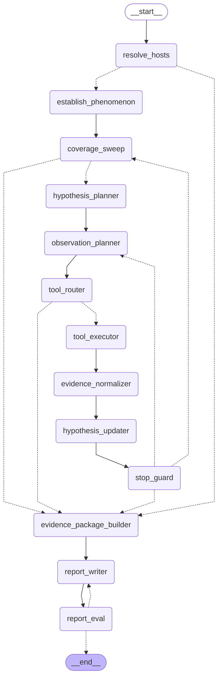

# Collector graph

Generated by `python -m aiops_rca.graph.diagram`. `tests/test_graph_diagram.py`
compares the edges below against the compiled graph, so this cannot drift from
the code without a test saying so.

Solid arrows are unconditional; dashed ones are the routing decisions in
`graph/routing.py`.

